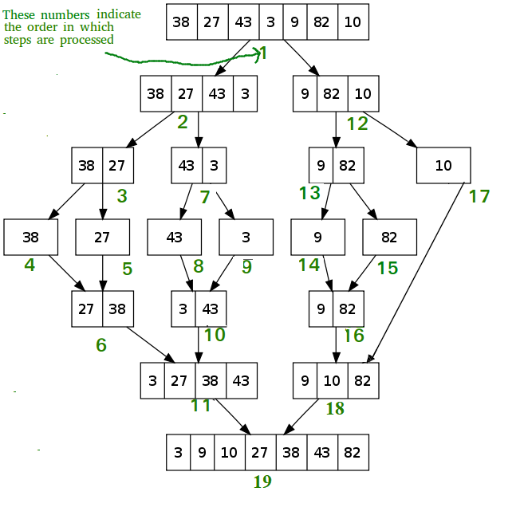

## What is Merge Sort?
Merge Sort는 **Divide-and-Conquer(분할 정복)** 알고리즘의 종류 중 하나이다.

## Procedure of Merge Sort
1. 데이터를 2개의 부분 배열로 나눔 **(Divide)**
2. 더이상 나누지 못하는 부분 배열끼리 정렬 **(Conquer)**
3. 정렬된 부분 배열을 합침 **(Combine)**

## Pros and Cons

- Pros
1. 시간 복잡도는 $$ O(nlogn) $$을 보장한다.